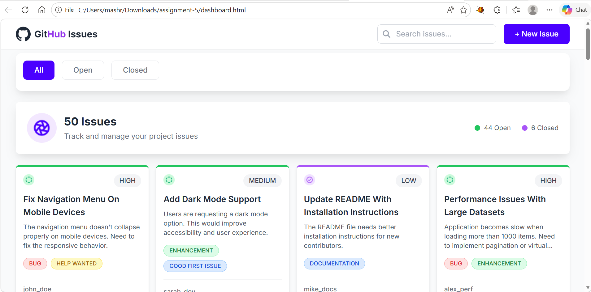

# GitHub Issues Tracker

একটি lightweight frontend project যেখানে GitHub-style issue list দেখা, filter করা এবং details modal-এ দেখা যায়।

## প্রজেক্ট ওভারভিউ

এই প্রজেক্টে একটি simple login page এবং একটি issue dashboard আছে।  
Login করার পর remote API থেকে issues load হয়, status অনুযায়ী filter করা যায়, search করা যায়, এবং issue details modal-এ দেখা যায়।

## স্ক্রিনশট

```md

```

চাইলে `GitHub Issues Tracker.fig` ফাইল থেকে design screen export করে ব্যবহার করতে পারেন।

## মেইন টেকনোলজি

- HTML5
- JavaScript (Vanilla ES6+)
- Tailwind CSS (CDN)
- Font Awesome (CDN)
- Google Fonts (Inter)
- REST API (`fetch`)
- Browser `localStorage` (auth state)

## মেইন ফিচারসমূহ

- Demo login system (default: `admin` / `admin123`)
- API থেকে issue list fetch
- Tab filter: All / Open / Closed
- Real-time search (title, description, labels)
- Issue statistics (total, open, closed)
- Issue details modal
- Responsive UI (desktop + mobile)

## Dependencies

এই প্রজেক্টে CDN-based dependency ব্যবহার করা হয়েছে (npm install দরকার নেই):

- Tailwind CSS: [https://cdn.tailwindcss.com](https://cdn.tailwindcss.com)
- Font Awesome 6.4.0: [https://cdnjs.cloudflare.com/ajax/libs/font-awesome/6.4.0/css/all.min.css](https://cdnjs.cloudflare.com/ajax/libs/font-awesome/6.4.0/css/all.min.css)
- Google Font Inter: [https://fonts.googleapis.com/css2?family=Inter:wght@300;400;500;600;700&display=swap](https://fonts.googleapis.com/css2?family=Inter:wght@300;400;500;600;700&display=swap)

## লোকাল মেশিনে রান করার গাইডলাইন

### Option 1: Directly run

1. Repository clone করুন:
   ```bash
   git clone https://github.com/shanta90/assignment-5.git
   ```
2. Project folder-এ যান:
   ```bash
   cd assignment-5
   ```
3. `index.html` browser-এ open করুন।

### Option 2: VS Code Live Server (recommended)

1. VS Code-এ project open করুন।
2. **Live Server** extension install করুন।
3. `index.html`-এ right click করে **Open with Live Server** দিন।

## লাইভ লিংক ও অন্যান্য রিলেভেন্ট লিংক

- Repository: [https://github.com/shanta90/assignment-5](https://github.com/shanta90/assignment-5)
- API Base URL: [https://phi-lab-server.vercel.app/api/v1/lab](https://phi-lab-server.vercel.app/api/v1/lab)
- Issues Endpoint: [https://phi-lab-server.vercel.app/api/v1/lab/issues](https://phi-lab-server.vercel.app/api/v1/lab/issues)
- Design File: `GitHub Issues Tracker.fig`
- Live Demo: [https://shanta90.github.io/assignment-5/](https://shanta90.github.io/assignment-5/)

## Demo Credentials

- Username: `admin`
- Password: `admin123`